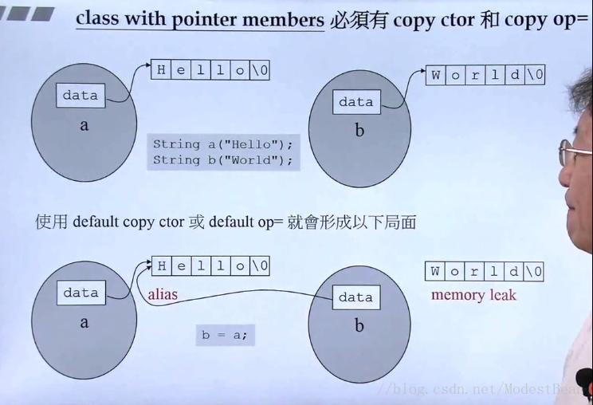
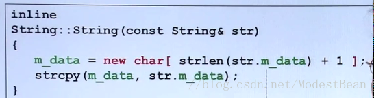
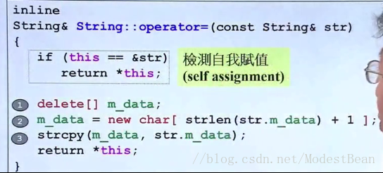
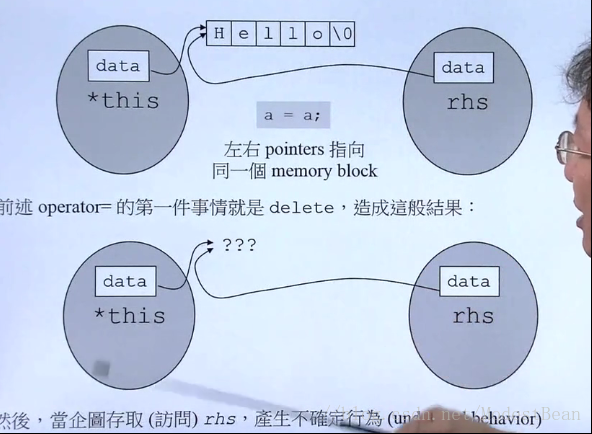

## 说在开始
我提炼了《C++ Primer》、《侯捷C++》、《高质量程序设计指南——C/C++语言》等资料中的重要部分，并总结成此博文。其中涉及到许多我个人对C++的理解，如若有不合理之处，还请朋友们多多指出，我会虚心接受每一个建议。

观看了侯捷老师有关于拷贝构造和拷贝赋值的方法，其中涉及到浅拷贝，深拷贝等问题，当然在看本节部分的时候可能会产生很多的问题，我也是如此，产生问题的原因是因为对C/C++的内存管理机制掌握不好，当掌握了C/C++内存管理的机制后这些问题就会迎刃而解了。<!--more-->我也会写一篇关于C/C++内存管理机制的博客的。在这里进行总结，本节的代码都可以在我的github上找到<https://github.com/ModestBean/C-Samples>。


本节解析了C++标准库当中的string类，自己用代码实现了，当然这里是阉割版，因为C++标准库当中的string功能实在是太复杂了，这里实现了几个简单的string的构造函数，拷贝函数等。

###### 我们应当时刻注意一点：当我们设计的类当中有指针的时候，一定要时刻注意内存泄露，野内存等问题，也就是当类中有指针的时候，我们应该时刻注意。
###### 如果自己的类当中含有指针，不可以使用编译器默认的拷贝函数，接下来我将会解释为什么不可以使用默认器的拷贝函数。
## 代码部分
先给出代码，看一下整个string类的基本架构吧，然后才好理解下面的概念问题，同样，侯捷老师把函数的实现代码放到了头文件当中，当然他使用了inline，大家需要注意.h文件用来声明是不进行编译的。
String.h
```
#ifndef _MY_STRING
#define _MY_STRING
class String
{
public:
	String(const char * cstr=0);//满足 String s1("hellow")的构造方式
	String(const String& str);//满足 String s1(s2)的构造方式
	String& operator = (const String& str);//满足 s1=s2的方式 
	~String();
private:
	char * m_data;//自己的数据数组
};
#include <cstring>
inline String::String(const char * cstr)//构造函数，满足 String s1("hellow")的构造方式
{
	if (cstr) {//判断是不是0
		m_data = new char[strlen(cstr) + 1];
		strcpy(m_data, cstr);
	}else {
		m_data = new char[1];
		*m_data = '\0';
	}
}
inline String::String(const String& str)//构造函数，满足 String s1(s2)的构造方式
{
	m_data = new char[strlen(str.m_data) + 1];
	strcpy(m_data, str.m_data);
}
inline String::~String()//析构函数
{
	delete[]  m_data;
}
inline String& String::operator =(const String& str){
	if(this==&str){//检测自我赋值 
		return *this;
	}
	delete[] m_data;
	m_data = new char[ strlen(str.m_data) + 1 ];
   	strcpy(m_data, str.m_data);
   	return *this;
}
#endif //_MY_STRING

```
main.cpp

```
#include <iostream>
#include "String.h"
using namespace std;
int main() {
	String s1("hello"); //第一种构造方式
    String s2("world"); 
    String s3(s2);//第二种构造方式
	/*
		两种构造方式：
		1、此时的s1是不存在的，直接将hello给s1
		2、第二种方式，s2和s3都是存在的，将s2的内容传递给s3
	*/
    s3 = s1;//把s1的值拷贝给s3，这里重载了操作符“=”，所以才可以完成，否则出现浅拷贝问题，稍后解释，继续往下看。
	cin.get();
	return 0;
}
```

## 几个概念
#### 浅拷贝
如果自己使用系统的拷贝函数。也就是直接赋值=。会出现以下的错误结果：浅拷贝



从图中可以看到有两个String 对象 a和b  ，其中a当中的data指针指向的是“Hello”，b的data指针指向的是“Wordld”。当使用系统的**a=b**时，会出现图片下半部分的错误。也就是a和b两个对象中的指针会同时指向“Hello”

###### 

1、造成内存泄露，两个data指针同时指向一个区域，“world”区域没有进行释放。
2、a，b两个对象中的data指针同时指向一个区域，操作可能会出现错误。

#### 深拷贝



这里使用了C原来的拷贝函数，首先动态分配了一块内存，然后将另一个字符串中的内容拷贝到新分配的内存中 。我使用VS2015使用这段代码的时候会提示该方法可能会出现安全性错误，建议使用strcpy_s,但是使用C-Free这种轻量行的编译器就不会出现这种错误。我的猜想有以下两点
1、C-Free比较轻量，VS适用于大型项目的开发，比较严谨。
2、C-Free更加倾向于C语言，对于C++语言的完善的可能不是很好。

#### 拷贝赋值函数



可以看出，此块代码是重载了操作符“=”也就是s1=s2所做的事情，这个方法也是比较重要的方法。其大致可以分为两大部分。
1、首先释放this指针指向的内容，然后分配一块与str指向的大小相同的内存区域，然后在进行深拷贝。
2、其中还有检测自我赋值的内容，这里应该时刻注意。如果检测到是自己赋值给自己，那么什么都不要做，直接返回，效率更高
3、如果不写自我检测可能会出现的错误结果：



前提，两个指针都是指向的Hello，当执行第一句代码`delete[] m_data;`后，两个指针指向的都是空内容，此时`m_data = new char[ strlen(str.m_data) + 1 ];`就无法处理。应该时刻注意。
## 最后
如果觉得文字内容不好理解的话，大家可以想看视频资源的话，可以 VX  qq619192323。有什么错误还希望大家指出，一起共同进步。
如果您喜欢C++，喜欢3D，并且想了解一点深度学习的知识，加入我们的QQ群，群里面全都是年轻的开发者，欢迎大家的加入讨论。就说是CSDN过来的就行。

