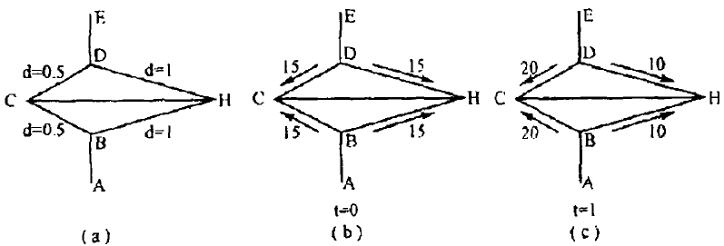
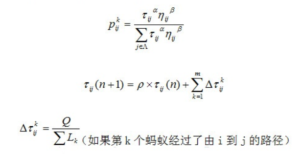
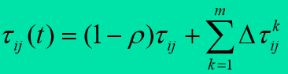
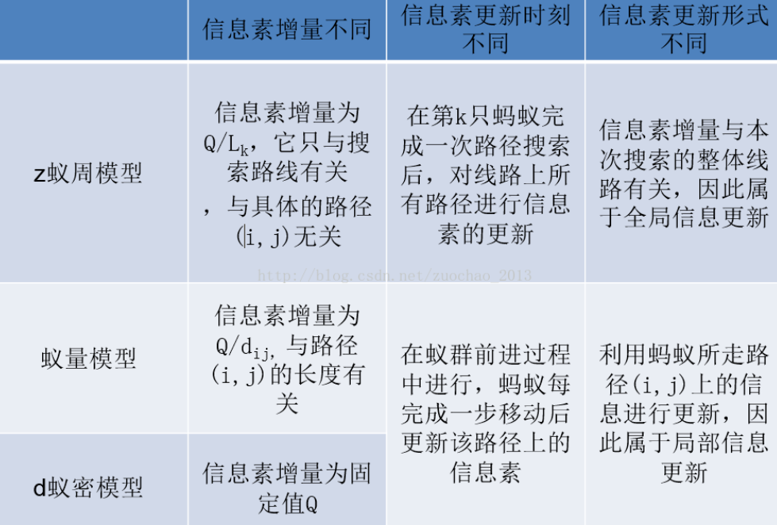
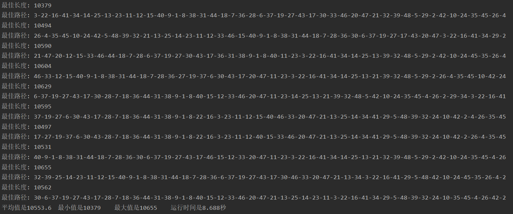

## 说在开始

发现有的文章缺公式数学模型，有的文章缺代码，有的文章缺推导过程,内容很杂乱。在这里我将多篇文章精华内容进行总结汇总，其中加入了我个人的见解，在文章最后我会给出参考链接。

<!--more-->

本节代码位置：<https://github.com/ModestBean/algorithm/tree/master/ACO_aunt_optimal_path> 代码中有非常详细的注释，建议下载代码看文章。

个人博客：<https://modestbean.github.io/>

CSDN：<https://blog.csdn.net/ModestBean>

知乎：<https://www.zhihu.com/people/yin-dou-49/activities>

## 1 群蚁算法的基本原理

[此部分内容参考链接](https://www.cnblogs.com/asxinyu/p/Path_Optimization_Tsp_Problem_Ant_System_CSharp.html#_label0)

首先推荐大家先阅读以下大连理工大学谷俊峰老师的蚁群算法PPT，下载链接为：<https://github.com/ModestBean/algorithm/tree/master/ACO_aunt_optimal_path/reference_material>

蚁群算法是受到对真实蚂蚁群觅食行为研究的启发而提出。生物学研究表明：一群相互协作的蚂蚁能够找到食物和巢穴之间的最短路径,而单只蚂蚁则不能。生物学家经过大量细致观察研究发现,蚂蚁个体之间的行为是相互作用相互影响的。蚂蚁在运动过程中,能够在它所经过的路径上留下一种称之为信息素的物质,而此物质恰恰是蚂蚁个体之间信息传递交流的载体。蚂蚁在运动时能够感知这种物质,并且习惯于追踪此物质爬行,当然爬行过程中还会释放信息素。一条路上的信息素踪迹越浓,其它蚂蚁将以越高的概率跟随爬行此路径,从而该路径上的信息素踪迹会被加强,因此,由大量蚂蚁组成的蚁群的集体行为便表现出一种信息正反馈现象。某一路径上走过的蚂蚁越多,则后来者选择该路径的可能性就越大。蚂蚁个体之间就是通过这种间接的通信机制实现协同搜索最短路径的目标的。我们举例简单说明蚂蚁觅食行为：

    

如上图a，b，c的示意图：

a图是原始状态，蚂蚁起始点为A，要到达E，中途有障碍物，要绕过才能到达。BC和BH是绕过障碍物的2条路径(假设只有2条)。各个路径的距离d已经标定。

b图是t=0时刻蚂蚁状态，各个边上有相等的信息素浓度，假设为15；

c图是t=1时刻蚂蚁经过后的状态，各个边的信息素浓度，有变化；因为大量蚂蚁的选择概率会不一样，而选择概率是和路径长度相关的。所以越短路径的浓度会越来越大，经过此短路径达到目的地的蚂蚁也会比其他路径多。这样大量的蚂蚁实践之后就找到了最短路径。所以这个过程本质可以概括为以下几点：

- 1、路径概率选择机制信息素踪迹越浓的路径，被选中的概率越大

- 2、信息素更新机制路径越短，路径上的信息素踪迹增长得越快

- 3、协同工作机制蚂蚁个体通过信息素进行信息交流。

从蚂蚁觅食的原理可见,单个个体的行为非常简单蚂蚁只知道跟踪信息素爬行并释放信息素，但组合后的群体智能又非常高蚂蚁群能在复杂的地理分布的清况下，轻松找到蚁穴与食物源之间的最短路径。这种特点恰恰与元启发算法的特点相一致，蚁群优化算法正是受到这种生态学现象的启发后加以模仿并改进而来，觅食的蚂蚁由人工蚁替代，蚂蚁释放的信息素变成了人工信息素，蚂蚁爬行和信息素的蒸发不再是连续不断的，而是在离散的时空中进行。

## 2 ACO蚂蚁算法的基本流程

群蚁算法的2个核心步骤是**路径构建**和**信息素更新**。

[此部分内容参考链接1](https://blog.csdn.net/Androidlushangderen/article/details/45395491#commentBox)

[此部分内容参考链接2](https://coolr321.github.io/2019/04/29/%E8%9A%81%E7%BE%A4%E7%AE%97%E6%B3%95%E8%A7%A3%E5%86%B3%E6%97%85%E8%A1%8C%E5%95%86%E9%97%AE%E9%A2%98/)

### 2.1 路径构建

    

下面解释以上各个变量的含义：

* P是前往每个城市的概率，也就是我们需要计算的。
* τ ij是从城市i到城市j的路径的信息素浓度。 
* η ij的字母是城市i到城市j距离的倒数。η ij = 1/d ij。

下面解释以上各个控制因子的含义：

* Alpha：信息启发式，Alpha值越大，蚂蚁选择之前走过路径的可能性就越大；值越小，蚁群搜索范围就越小，容易陷入局部最优。
* Beta：期望启发式因子，Beta越大，蚁群越容易选择局部较短路径，这时算法收敛速度加快，但随机性不高，容易得到局部最优解。
* M：蚁群数量，M越大，最优解越精确，但会产生重复解，消耗资源，增大时间复杂度。
* RHO：信息素发挥因子，1-RHO表示残留因子，RHO过小，各路径上残留信息素过多，导致无效路径继续被搜素，影响算法收敛效率；RHO过大，有效路径可能会被放弃搜索，影响最优解的搜索。
* Q：用于信息素增量的设置，在蚁周模型下，信息素增量=Q/当前解路径总长度。蚁周模型利用的是全局信息，即蚂蚁完成一个循环后更新所有路径上的信息素

所有的公式都是为第一个公式服务的，第一个公式的意思是指第k只蚂蚁选择从城市i到城市j的概率，可以见得，这个受距离和信息素浓度的双重影响，距离越远，去此城市的概率自然也低，所以nij会等于距离的倒数，而且在算信息素浓度的时候，也考虑到了信息素浓度衰减的问题，所以会在上次的浓度值上乘以一个衰减因子P。另外还要加上本轮搜索增加的信息素浓度（假如有蚂蚁经过此路径的话），所以这几个公式的整体设计思想还是非常棒的。

### 2.2 信息素更新

参考内容：[大连理工大学蚂蚁算法PPT](https://github.com/ModestBean/algorithm/tree/master/ACO_aunt_optimal_path/reference_material)

信息素更新是群蚁算法的核心，首先看公式：

    

初始化信息素浓度C(0)，如果太小，算法容易早熟，蚂蚁会很快集中到一条局部最优路径上来，因为可以想想，太小C值，使得和每次挥发和增强的值都差不多，那么随机情况下，一些小概率的事件发生就会增加非最优路径的信息素浓度；如果C太大，信息素对搜索方向的指导性作用减低，影响算法性能。一般情况下，我们可以使用贪婪算法获取一个路径值Cnn，然后根据蚂蚁个数来计算**C(0) = m/Cnn ,m为蚂蚁个数。**

总共可以分为两步骤：

（1）首先，每一轮过后，问题空间中的所有路径上的信息素都会发生蒸发

（2）然后，所有的蚂蚁根据自己构建的路径长度在它们本轮经过的边上释放信息素

只有文字描述可能不太好理解，根据公式比较好理解。

### 2.3 蚂蚁算法信息素更新模型

[参考内容链接](https://blog.csdn.net/fanxin_i/article/details/80380733)

信息素更新模型可以分为以下三种蚁周模型（Ant-Cycle模型）、蚁量模型（Ant-Quantity模型）、蚁密模型（Ant-Density模型），**本篇博客实现的模型为蚁周模型**。  具体细节如下。

    

## 3 项目所采用的数据集

采用的数据集为美国城市att48,，文件存储的为每一个城市的X，Y坐标，根据距离公式可以计算每个城市之间的距离。其最短路径最优值为10628。

## 4 代码部分和运行结果

    

