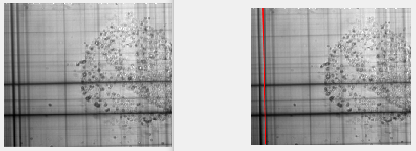
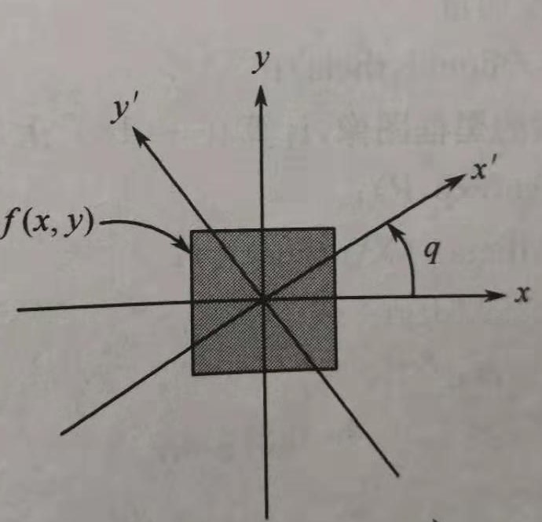
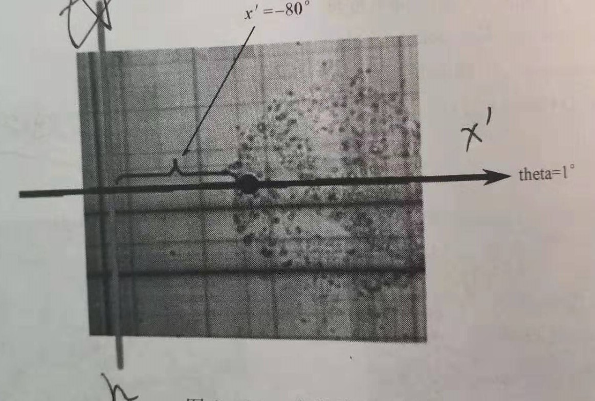
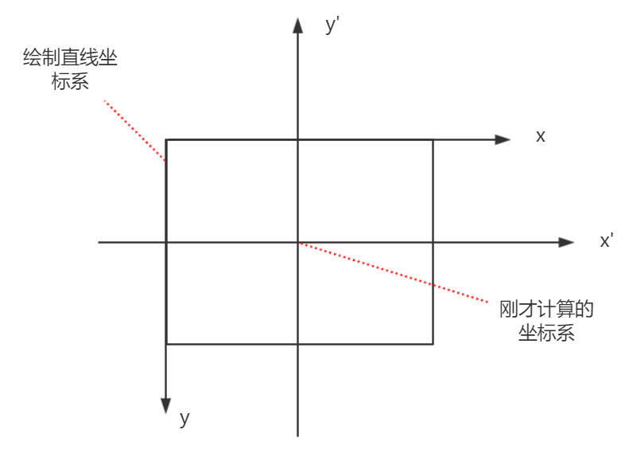

## 说在开始

作业部分需要使用radon进行直线检测，查了许多国内资料和国外资料，发现所有参考资料只给出了如何得到radon变换后的统计图，却没有给出如何计算radon的峰值，以及如何在图像中绘制中检测到的直线。本篇文章即解决此问题，来看看是怎么实现的吧。

<!--more-->

本节代码位置：<https://github.com/ModestBean/algorithm/blob/master/image-processing/radon_line_detection.m> 如果感觉对您有用请点一下star，谢谢。代码中有非常详细的注释，建议下载代码看文章。

- 个人博客：<https://modestbean.github.io/>
- CSDN：<https://blog.csdn.net/ModestBean>
- 知乎：<https://www.zhihu.com/people/yin-dou-49/activities>
- QQ交流群：**740855975** 欢迎加入交流，其中包括3D图形学，three.js，OpenGL，Unity，UE4，图形图像处理，实时渲染等。

## 执行效果

红色直线为检测并绘制的直线。

<div align=center>
    
</div>

## 1 radon变换直线检测的基本原理

### 1.1 基本原理

radon转换的基本原理在大多说资料上都可以找到，其本质就是计算图像沿着指定方向上的投影，本篇文章主要讲解如何得到峰值的theta和distance并绘制直线，原理部分请看：<https://www.mathworks.com/help/images/detect-lines-using-the-radon-transform.html>

**强烈建议搞懂基本原理部分后再往下阅读！**

### 1.2 radon直线检测并绘制步骤

 - 将灰度图像转换成二进制图像
 - 对二值图像执行radon变换
 - 在radon变换矩阵中找到强峰
 - 根据强峰得到图像中直线的角度与距离
 - 根据直线的theta和distance计算出检测直线的位置

## 代码实现

原理部分不太好讲，直接一步一步跟着代码来看。（PS：暂时没有找到好的matlab代码的美化工具，先凑活看吧~）


```matlab
% @author 憨豆酒 YinDou yindou97@163.com
% @date 20191002
% @description radon直线检测 
% 建议先阅读本节博客：
% 本节实现的为检测一条直线，若想实现检测多条直线，需要计算多次最大值
clc
clear all;
close all;

% 读取原始图像
I = fitsread('solarspectra.fts');
I = mat2gray(I);
figure(1),imshow(I);
figure(2),imshow(I);
BW = edge(I);
[height, width ] = size (I);
width_half = width / 2.0;
height_half = height / 2.0;
```

 - 此部分代码很好懂，就不在讲解。计算宽度的一半，图像的边缘等都是为了下面的计算。

```matlab
% 执行radon函数
theta = 1:180;
[R,xp] = radon(BW,theta);
[M,N]=size(R);
% reshape二维矩阵R，变换成一维向量
J=reshape(R,M*N,1);
```

 - 1~2行执行radon函数，在theta1,2,3,4，5......180度分别执行radon变换。返回值R为每一列对应图像I在theta某一角度的Radon变换值，xp表示沿着x’轴相应的坐标值
 - 5行对R向量reshape，为了计算峰值作准备。

```matlab
% 寻找最大值的索引
% J排序，倒序
sort_J = sort(J, 'descend');
% 取向量J中最大值
% 本节实现的为检测一条直线，若想实现检测多条直线，需要计算第二大值，第三大值，第.....
max_value = sort_J(1);
% 得到在矩阵索引，在数组中的索引
[row,col] = find(R == max_value);
 % 将数组索引变换成theta和distance，详情见博客
max_line_theta = col;
max_line_distance = row - 129;
```
- 3行对J进行倒排序
- 6行得到最大值，并得到最大值在数组中的索引。
- 9~10 将数组索引变换成theta和distance，此部分比较重要，来看看是如何转换的吧。

首先给出Radon变换系数的图像，生成此图像使用了imagesc(theta, xp, R)函数，此函数的使用方法在['参考链接'](https://www.mathworks.com/help/matlab/ref/imagesc.html)

<div align=center>
    
</div>

图表与此函数imagesc(theta, xp, R)对应来看。横轴xp，纵轴theta，R为二维矩阵的值，对应最右边的条状图。颜色越深表示值越大。也就是说越白色的点越表示值越大，越可能是峰值。

绿色部分为峰值，此峰值theta为1，distance为-80。好了那么问题来了，从上面部分数组索引为(1，49)如何转换成要的theta和distance呢。是这样的，坐标系的转换。从上面的图中发现，纵轴的0在中间位置，而数组的0是在左上角，所以只需要减去129（**149为R矩阵高度的一半**）即可，-80 = 49 - 129。

```matlab
% k过图像中心点直线斜率，k2为检测直线斜率
k = tan(max_line_theta*pi/180.0);
k2 = -1.0/k;
% 坐标系原点
x0 = 0.0;
y0 = 0.0;
```
<div align=center>
    
    
</div>

很好理解，在上图中，k为x'的斜率，k2为直线h的斜率。

```matlab
% 计算两条直线交点
% 定义变量x
syms x 
d = sqrt((k*x-y0)^2+(x-x0)^2);
soln  = solve(d == abs(max_line_distance),x);
% radon的峰值在图像左侧，所以判断。 不同的图像注意区分，如若使用此代码记得修改
if soln(1)<=0
    xT = soln(1);
else
    xT = soln(2);
end
yT = k*xT;
```
- 此部分计算直线x'与直线h的交点(xT, yT)。因为根据距离计算，会得到两个值，检测直线在图像左侧，判断小于0即可。

```matlab
% 检测的直线与图像最上侧和最下侧的交点，涉及到图像坐标系变换，详情见博客
y1 = 0.0;
x1 = (height_half - y1 - yT)/k2 + xT + width_half;
y2 = 165.0;
x2 = (height_half - y2 - yT)/k2 + xT + width_half;
hold on;
% 绘制直线
line([x1, x2],[y1,y2],'color','r','LineWidth',1); 
```
- 现在已经得到了直线h的斜率k2和过的点(xT, yT)，直线方程就有了，可以绘制直线了，**但是需要注意的是：**绘制直线和刚才计算的直系h所在的坐标系不同。

<div align=center>
    
</div>

- 根据y - yT = k2 * (x - xT)计算得到的交点为(x1',y1')和(x2', y2')，根据坐标系转换公式 y = -y' + height_half（高度一半） 和 x = x' + width_half（宽度一半）。最终得到最终的 (x1,y1)和(x2,y2)。