## 说在开始

经历了一个痛苦的过程，做骨架提取的很少众，做三维骨架提取的更加少，中文资料也很少，在这里进行总结，帮助需要的人。如果需要源代码的话，联系我就可以。在最后我会给出参考链接。

先看一下效果，这样才会有读下去的欲望。

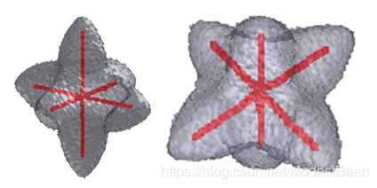

<!--more -->

## 在介绍之前，有一点基础知识需要介绍，关于两种三维模型的表达方式：

 - 体素（Voxel）：可以产生体数据集，不仅包含模型的表面信息，而且可以描述模型的内部属性。与表示图像的二维像素比较类似，只不过是从二维的像素扩展到了三维的立方体单元。应用领域：三维成像、地理分析、化学分析、科学资料与医学影像等等等。

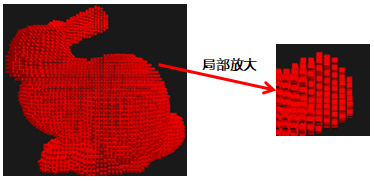

 - 面片（Mesh）：三角网格就是由一系列三角形组成的多边形网格，主要用于模拟复杂物体的表面。无法描述模型的内部信息。有多种表达格式，例如OBJ、PLY等，所包含的信息也不同。但都包含顶点信息。应用领域：图形处理，实时渲染、3D人物模型等。

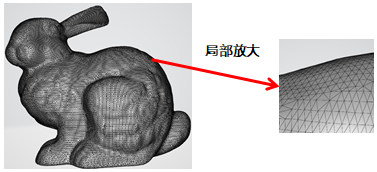

## 基于体素的骨架提取的框架以及算法：

目前找到的共三种：

（1）Python的scikit图像处理库的skeleton_3D方法  [点击链接](https://scikit-image.org/docs/dev/auto_examples/edges/plot_skeleton.html#sphx-glr-auto-examples-edges-plot-skeleton-py) 

（2）matlab的第三开发者骨架提取框架skeleton3d [点击链接](https://ww2.mathworks.cn/matlabcentral/fileexchange/43400-skeleton3d) 

（3）图像处理程序ImageJ、ImagePy。熟悉图像处理领域的读者应该很清楚ImageJ。而ImagePy是国内开发人员开的框架，它模拟了ImageJ。

以下为对应的官方案例。

（1）scikit中没有给出三维案例，只给出了二维案例。

（2）matlab的展示结果

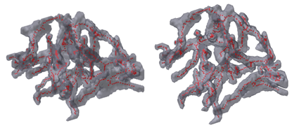

（3）ImagePy的展示结果

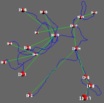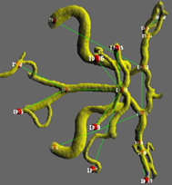

这三者使用都是1994年的算法：Building Skeleton Models via 3-D Medial Surface/Axis Thinning Algorithms有兴趣的可以看一下这个Paper。

## 基于三维面片的骨架提取算法：

基于三维面片的骨架提取算法可以参考此篇Paper：Skeleton Extraction by Mesh Contraction

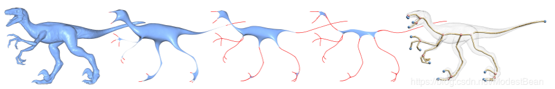

## 骨架分析：

在这篇教程中很详细的描述了骨架分析的方法，包括骨架节点的提取，骨架长度的提取等等。[点击链接](https://zhuanlan.zhihu.com/p/31387917)

可以查看一下我的分析效果：

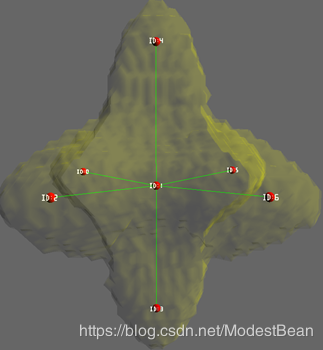

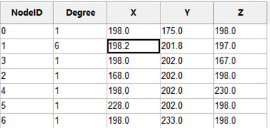

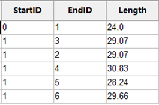

** 如果在使用和运行过程中遇到什么问题欢迎联系我，yindou97@163.com QQ：619192323 **

如果您对3D开发感兴趣，欢迎加入，这里面全部都是年轻的开发者，也许不能帮助您解决问题，但是可以一些好的建议。如果感兴趣您可以加群，就说是CSDN过来的就可以。

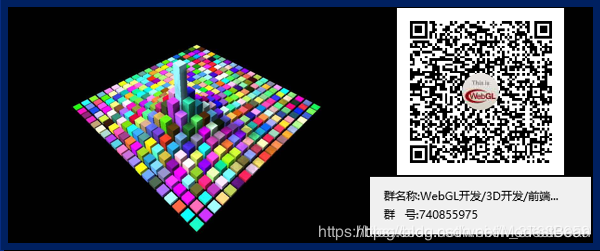