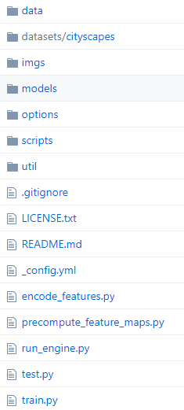
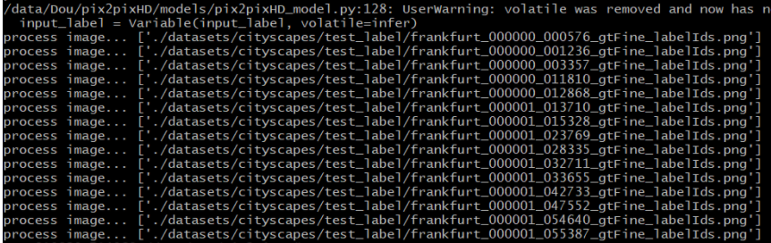
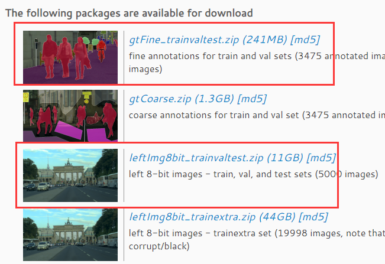
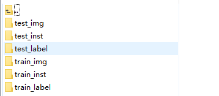
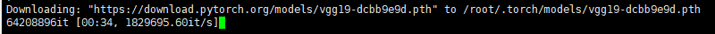
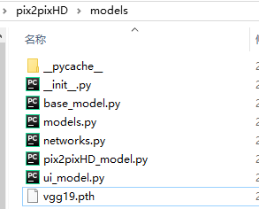
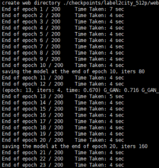

本周的新任务是编译运行Github上pix2pixHD的源代码，调研时，发现居然没有一篇中文博客来讲解pix2pixHD源代码的编译运行调试的。当按照它Github的README来编译运行，过程中会遇到许多新问题，在这里进行总结，希望可以帮助需要的人。

<!--more-->
其源代码的Github链接为<https://github.com/NVIDIA/pix2pixHD>，我使用的操作系统为Linux，论文为：**High-Resolution Image Synthesis and Semantic Manipulation with Conditional GANs**

# 说明

建议本博客和Github的README共同来阅读。本篇博客只是辅助编译运行，具体细节还请看Github原链接。

# 目录结构



# 开始

## 所需环境

 - pytorch
 - python lib dominate


## 下载源代码

```
git clone https://github.com/NVIDIA/pix2pixHD
cd pix2pixHD
```

## Test测试

！！！！请配合下文的注意一起看。

- 数据集在 `datasets`文件夹
- 在测试之前需要下载已经训练好的模型 [链接](https://drive.google.com/file/d/1h9SykUnuZul7J3Nbms2QGH1wa85nbN2-/view?usp=sharing) 放在文件夹 `./checkpoints/label2city_1024p/`
- 运行脚本`bash ./scripts/test_1024p.sh` 或者在Terminal中输入

 ```bash
 #!./scripts/test_1024p.sh
python test.py --name label2city_1024p --netG local --ngf 32 --resize_or_crop none
 ```
测试的结果在`./results/label2city_1024p/test_latest/index.html`可以看到

更多的脚本在 `scripts` 文件夹中可以看到


### 注意

在命令中最后一个参数控制的图像的大小resize重新设置大小，crop是对图像进行裁剪，如果直接使用--resize_or_crop none是跑不起来的，起码我在1080Ti 12GB上面跑步起来，关于resize和crop的内容在 `options目录下的base_options.py`，这里需要说明一下，`options`文件夹下的都是参数，一看就知道是干啥的了。

在Terminal中输入，也可以看到resize和crop的内容：

```bash
python test.py -h
```

我在1080Ti 12GB 可以跑起来的命令是，当然结果也是低分辨率的1080*512
```bash
python3 test.py --name  label2city_1024p --netG local --ngf 32 
```

如果可以看到以下结果，说明环境没问题了，就可以开始训练了。



## 重头戏：train，训练

### 下载数据集

在这里下载[official website](https://www.cityscapes-dataset.com/)数据集，这两个都需要下载。



下载后还需要将数据集整理成与源代码的格式相同，或者修改源代码也可，但是我建议整理数据集。



这里我给出整理数据集的Python代码，将多个文件夹中的图像整合到一个文件夹中：
```python
import os
root_path='./datasets/cityscapes/'
in_path=root_path+'gtFine/val/'
out_label_path=root_path+'test_label/'
out_inst_path=root_path+'test_inst/'
os.makedirs(out_label_path)
os.makedirs(out_inst_path)
for r,p,f in os.walk(in_path):
    for name in f:
        if 'instanceIds' in name:
            shutil.copy(os.path.join(r,name),out_inst_path+name)
        elif 'labelIds' in name:
            shutil.copy(os.path.join(r,name),out_label_path+name)
```

### 训练命令

```bash
python train.py --name label2city_512p --gpu_ids 1,2  --batchSize 2 --tf_log --checkpoints_dir="./checkpoints_/"
```

关于使用的参数的含义，请查看 train.py -h或者源代码。

当运行上面的bash时可能会遇到以下情况：

（1）会自动下载pytorch的VGG模型：



可以等待他下载，但是我没有等着，而是下载好后，放到项目里面，然后直接在本地进行加载的。我将下载好的pth文件放在了`pix2pixHD\models`目录下，如下。



加载模型的代码在`models/networks.py`里面，修改如下：

```python
class Vgg19(torch.nn.Module):
    def __init__(self, requires_grad=False):
        super(Vgg19, self).__init__()
        net = models.vgg19(pretrained=False)
        net.load_state_dict(torch.load("./models/vgg19.pth"))
        vgg_pretrained_features = net.features
        ....
```

（2）使用 --tf_log时，无法正常启动tensorboard。 我这里遇到的情况是源代码使用的tensorboard的接口和本机不一样，就把tensorboard改成了tensorboardX。有时候可能会遇到此问题，得看自己电脑上的环境。

将 `util/visualizer.py`进行以下修改

```python
# 25行修改为
self.writer = SummaryWriter(self.log_dir)

# 44~56 修改为
self.writer.add_image(label,image_numpy,step,dataformats='HWC')

# 100~102行修改为
self.writer.add_scalars('loss',errors,step)
```

(3)在训练成功后，需要运行test.py进行测试，此时需要注意。cityscapes数据集中的测试集中的图像是空内容，需要使用val验证集的图像进行测试，打开数据集后就可以看到。

### 训练如下

当所有问题都解决后，就可以到如下的训练结果了：



# 最后

以上为本人遇到的问题，可能你与我遇到的问题不一样，也可能你和我最终的目的不一样，但是都可以来邮商量。yindou97@163.com